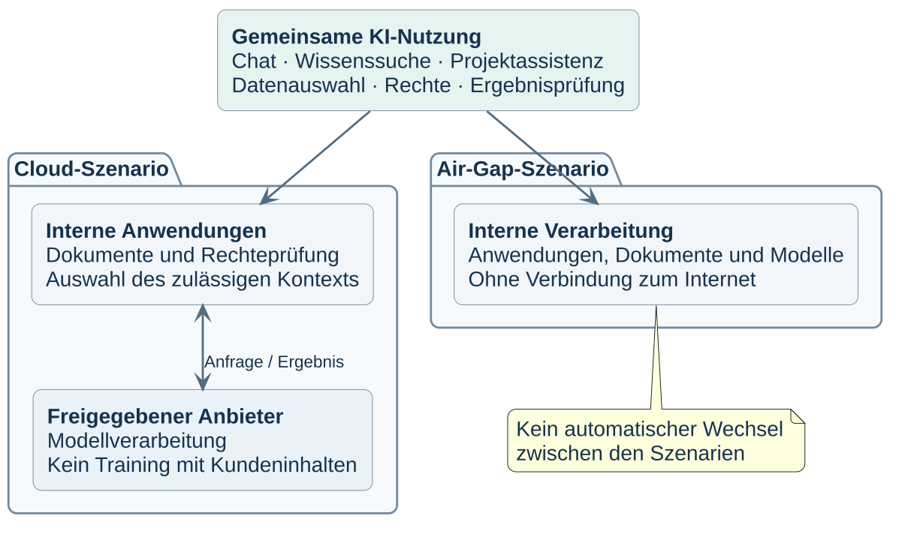

# Allgemeines KI-Informationssicherheitskonzept

**ÖFFENTLICH – organisationsneutrale Referenzvorlage · Version 0.3.0**

Das Konzept ergänzt ein bestehendes Informationssicherheitskonzept um KI-spezifische Funktionen, Schutzmaßnahmen und Risiken. Es beschreibt **Air-Gap** und **Cloud-Inferenz** als getrennte Szenarien. Produkte und Hardwareparameter bleiben außerhalb der fachlichen Festlegungen.



## Dokumente

- [Konzept als PDF](konzept/ki-it-sicherheitskonzept.pdf) und [bearbeitbares DOCX](konzept/ki-it-sicherheitskonzept.docx).
- [Nutzerbelehrung als digital unterschreibbares PDF](konzept/anlage-1-nutzerbelehrung.pdf) und [DOCX](konzept/anlage-1-nutzerbelehrung.docx).
- [Normativer OSCAL-Katalog](katalog/ki-it-sicherheitskatalog.oscal.json) mit 34 Kontrollen in 22 Fachgruppen.
- [Inhaltsindex](dokumentation/INHALTSINDEX.md), [Quellenregister](quellen/quellenregister.json) und [Prüfprotokoll](dokumentation/PRÜFPROTOKOLL-0.3.0.md).

Der Katalog ist die normative Quelle. Das Konzept enthält Festlegungen und Anwendung ohne zusätzliche Nachweisregister oder wiederholte Grund-IT-Anforderungen. Neun Risiken besitzen jeweils eine Air-Gap- und eine Cloud-Bewertung. Vollständige Quellen stehen im Quellenverzeichnis, Begriffserklärungen im tabellarischen Glossar am Ende.

## Szenarien

| Gegenstand | Air-Gap | Cloud |
|---|---|---|
| Modellverarbeitung | Innerhalb der abgeschlossenen Umgebung | Beim ausdrücklich freigegebenen Anbieter |
| Externe Verbindung | Keine Netzwerkverbindung zum Internet oder zu externen KI-Diensten | Begrenzte Verbindung zum zugelassenen Modellendpunkt |
| Dokumente und Wissenssuche | Intern | Intern, nur ausgewählte berechtigte Ausschnitte werden übermittelt |
| Werkzeuge | Unter betrieblicher Kontrolle | Unter betrieblicher Kontrolle, keine anbieterbetriebenen Werkzeuge |
| Training | Eigenes Training und Feinabstimmung ausgeschlossen | Zusätzlich keine Nutzung von Kundeninhalten für Anbietertraining |
| Wechsel bei Fehlern | Nur freigegebene interne Ziele | Nur separat für denselben Datenumfang freigegebene Ziele |

Die Risikobewertungen gelten unter den im Katalog beschriebenen Bedingungen. Sie sind keine Abnahme einer tatsächlichen Umgebung. Allgemeine Infrastruktur-, Vertrags- und Datenschutzprozesse werden durch die KI-Ergänzung nicht ersetzt.

## Organisationsspezifische Übernahme

Interne Angaben gehören ausschließlich in eine getrennte, angemessen geschützte Fassung. Deren Kennzeichnung, Verarbeitungsumfang und Risiken werden anhand der tatsächlichen Umgebung festgelegt. Der [Übernahmeleitfaden](dokumentation/ÜBERNAHMELEITFADEN.md) beschreibt das Vorgehen. Private Inhalte dürfen nicht in dieses Referenzrepository gelangen. Freigegebene allgemeine Formulierungen und Gestaltung werden vor jeder Übertragung auf Organisationsbezüge geprüft.

`projektstatus.json` schützt den organisationsneutralen Inhalt der Referenzablage. `organisationsspezifisch`, `externe-inferenz`, `modelltraining` und `feinabstimmung` bleiben hier `false`. Diese Ablage betreibt keinen KI-Dienst. Das Feld `externe-inferenz` schaltet daher nicht das im Katalog beschriebene Cloud-Szenario aus. Der Dokumentgenerator verweigert die Ausgabe bei einem abweichenden Projektstatus. Die Dokumentkennzeichnung `ÖFFENTLICH` ist unabhängig von der Sichtbarkeit des GitHub-Repositories.

## Erzeugung und Prüfung

Benötigt werden Python ab 3.11 mit den fixierten [Prüfabhängigkeiten](validierung/anforderungen.txt), Java ab 17, die geprüfte PlantUML-Fassung und Microsoft Word für den PDF-Export. Poppler dient der Sichtprüfung. Vorhandene lokale Werkzeuge werden weiterverwendet.

```powershell
python -m pip install -r validierung/anforderungen.txt
python validierung/erzeuge_diagramme.py --werkzeug-herunterladen
python validierung/erzeuge_dokumente.py
powershell -NoProfile -ExecutionPolicy Bypass -File validierung/aktualisiere_word_felder.ps1
python validierung/erzeuge_dokumente.py --belehrung
powershell -NoProfile -ExecutionPolicy Bypass -File validierung/aktualisiere_word_felder.ps1 -DocxPfad konzept/anlage-1-nutzerbelehrung.docx -PdfPfad konzept/anlage-1-nutzerbelehrung.pdf -OhneInhaltsverzeichnis
python validierung/erzeuge_dokumente.py --belehrung-formular konzept/anlage-1-nutzerbelehrung.pdf
python validierung/validiere_projekt.py --streng --online --ohne-lokale-eingaben
python -m unittest discover -s validierung/testfälle -p "test_*.py"
```

Die PDF-Dateien werden aus den gespeicherten DOCX-Dateien erzeugt. Nur die Formularfelder der Belehrung werden anschließend ergänzt. Der Word-Export aktualisiert Inhaltsverzeichnis und Seitenzahlen. Alle Seiten werden gerendert und visuell geprüft. Die acht Diagramme bleiben als PlantUML, SVG und PNG mit gemeinsamem Prüfsummenmanifest versioniert.

Auf Dateisystemen ohne verlässliche Eigentümerinformationen wird Git ausschließlich für den jeweiligen Prozess freigegeben:

```powershell
$env:GIT_CONFIG_COUNT = '1'
$env:GIT_CONFIG_KEY_0 = 'safe.directory'
$env:GIT_CONFIG_VALUE_0 = (Get-Location).Path.Replace('\','/')
```

## Projektstruktur

| Verzeichnis | Inhalt |
|---|---|
| `katalog/` | OSCAL 1.1.3 als normative Quelle |
| `konzept/` | Konzept und Nutzerbelehrung als DOCX/PDF |
| `diagramme/` | Editierbare Diagrammquellen und Manifest |
| `quellen/` | Öffentliche Quellen und konkrete Fundstellen |
| `schemata/` | Offizielles OSCAL-Schema und Registerschema |
| `validierung/` | Generatoren, Export und Prüfungen |
| `dokumentation/` | Index, Arbeitsregeln, Übernahme und Prüfberichte |

`quellen/lokale-eingaben/` und `.arbeitsdaten/` bleiben Git-ignoriert. Die GitHub-Workflows prüfen die Fachartefakte und erzeugen ein commitgebundenes Veröffentlichungsarchiv. Es gibt keine Anwendung, Containerveröffentlichung oder automatisch erstellte GitHub Releases.

## Quellen, Mitwirkung und Lizenz

Kontroll- und Quellenkennungen bleiben stabil. Methodische Herleitungen und orientierende BSI-/ISO-Zuordnungen stehen im Katalog. Proprietäre Normtexte werden nicht übernommen. Das Projekt erteilt keine Systemfreigabe und stellt kein Zertifikat aus.

Beiträge folgen [CONTRIBUTING.md](CONTRIBUTING.md), sensible Meldungen [SECURITY.md](SECURITY.md). Für das Gesamtwerk ist keine Lizenzentscheidung getroffen. Es besteht daher keine allgemeine Nutzungserlaubnis über gesetzliche Schranken hinaus. Die bestehenden Maintainer-Entscheidungen stehen in der [Wartungscheckliste](dokumentation/WARTUNGSCHECKLISTE.md).
