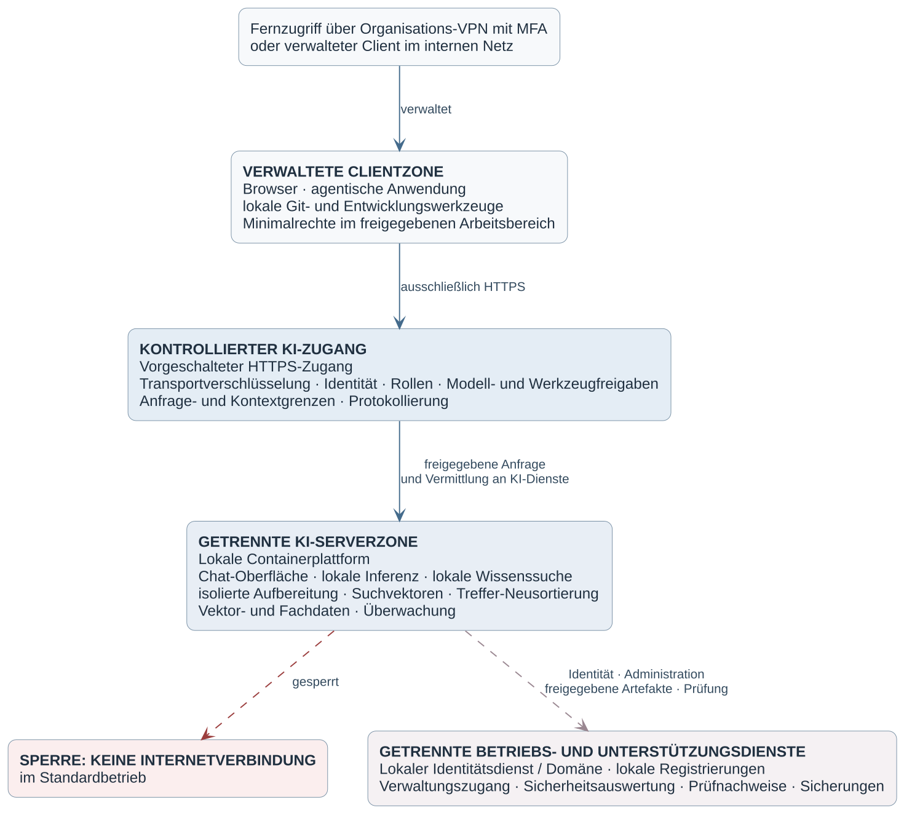
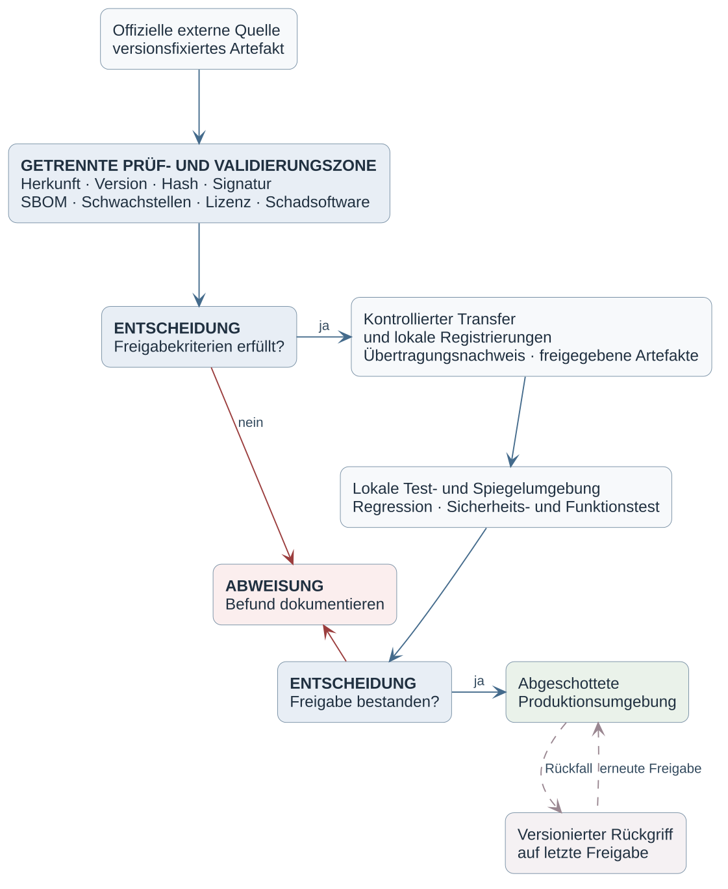
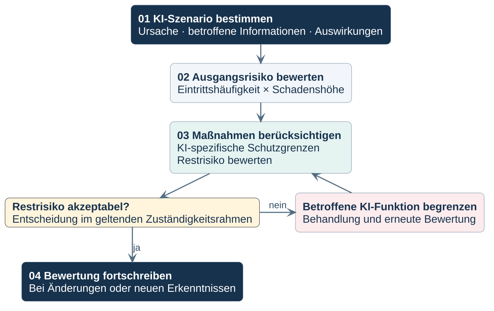
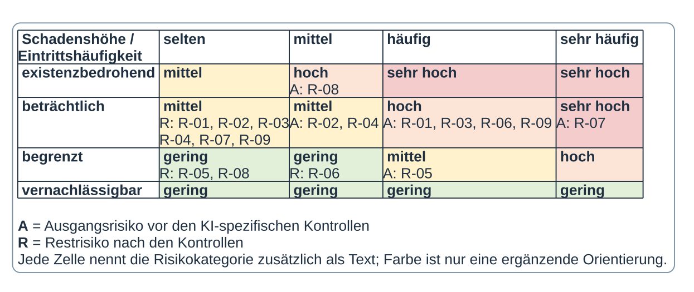
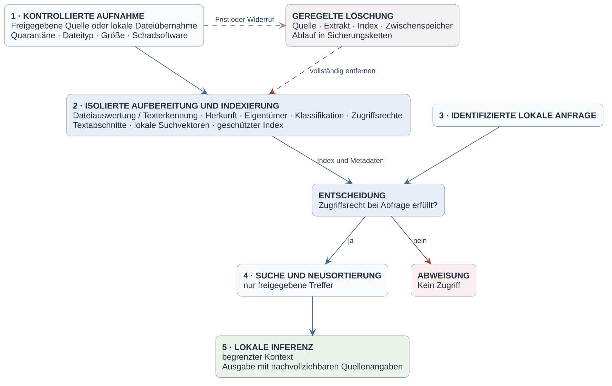
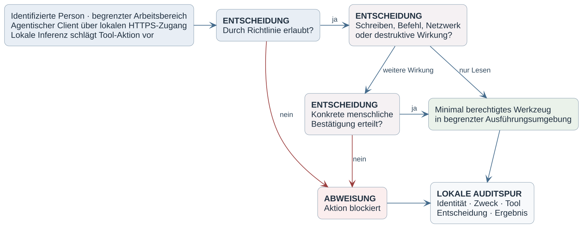

# Organisationsneutrale KI-Referenzarchitektur

Die unternehmensintegrierte Umgebung bevorzugt lokale Inferenz auf zentralen Diensten oder verwalteten Endgeräten. Bestehende Anmeldung, Datenablagen, Entwicklungs- und Betriebsdienste bleiben nach dem IT-Sicherheitskonzept nutzbar. Container sind optional. Maßgeblich sind die Kontrollen im [Katalog](../katalog/ki-it-sicherheitskatalog.oscal.json), erschlossen über den [Inhaltsindex](INHALTSINDEX.md#kontrollen).

Verwaltete Clients verwenden kontrollierte Anfragepfade. Vorhandene Anmeldung darf ohne zusätzlichen KI-Login genutzt werden, sofern Identität und Rechte vertrauenswürdig übernommen werden. Netzwerkzugehörigkeit allein genügt nicht. Direkte Inferenz-, Verwaltungs- oder Diagnoseschnittstellen dürfen diese Regeln nicht umgehen. Gemeinsame Dienstschlüssel ersetzen keine individuelle Nutzerzuordnung und Sperrbarkeit.

Externe Inferenz bleibt standardmäßig aus. Allgemeine Internet- und IdP-Freigaben ersetzen die zusätzliche Freigabe für KI, Zweck und Daten nicht. Bereits freigegebene lokale oder externe Modelle können in optionalen Ausweichprofilen verwendet werden. Ein automatischer Wechsel auf andere Ziele bleibt gesperrt.

## Artefakte und Änderungen

Modelle, Pakete und Erweiterungen verwenden die vorhandenen Beschaffungs-, Software- und Änderungsprozesse. Herkunft und Integrität werden geprüft; verfügbare Signaturen ergänzen diese Prüfung. Routineänderungen laufen innerhalb freigegebener Profile. Wesentliche Modell-, Rechte- oder Datenflussänderungen erhalten eine gezielte Bewertung. Eine Wiederherstellung bewahrt aktuelle Rechte und Löschstände.

## Risiken und Weiterarbeit

Mittlere Restrisiken können im Unternehmensrahmen begründet akzeptiert werden. Hohe und sehr hohe Risiken sperren betroffene Funktionen, sofern kein ausdrücklich genehmigter befristeter Betrieb mit zusätzlichen Maßnahmen zulässig ist. Akute Gefahren, unzulässige Verarbeitung, fehlende Rechte und unverzichtbare KI-Abhängigkeiten erlauben keine Ausnahme.

Die neun Risiken liegen im Katalog unter `ki-gov-003-risk-register`. Die PlantUML-Matrix und die Konzeptdarstellung werden daraus erzeugt. Die Planungsbewertung ersetzt keine Prüfung der tatsächlichen Unternehmensumsetzung.

Jede Tätigkeit bleibt auch bei längerem KI-Ausfall durchführbar. Daten, Zugänge, Anwendungen und Kenntnisse sind unabhängig verfügbar. Ressourcenisolation schützt andere Dienste. Reparatur und Wiederaufnahme erfolgen über den normalen IT-Betrieb; Ersatzserver oder weitere Modelle sind optional.

## Wissensarbeit und Daten

Freigegebene Datenbereiche können Dokumente für KI-Wissensarbeit abdecken. Die normalen Dokumenten-, Qualitäts- und Konfigurationsprozesse bleiben maßgeblich. Persönliche Speicherung auf verwalteten Endgeräten ist nach den normalen Regeln zulässig.

Unternehmenswissen aus persönlicher Agentenarbeit ist standardmäßig ausgeschaltet. Informierte Zustimmung bei Erstnutzung und jedem Agentenprojekt, sichtbarer Zustand und sichere Rechteübernahme sind Voraussetzung. Gewöhnliche Chatdialoge werden nicht automatisch übernommen. Ein Stopp beendet neue Beiträge; bestehende folgen den erläuterten Nutzungs- und Aufbewahrungsregeln. Rechteverlust oder unzulässige Nutzung lösen unabhängig davon Sperrung beziehungsweise Löschung aus.

Suchvektoren, Zusammenfassungen, Textabschnitte und Antworten dürfen keinen größeren unberechtigten Empfängerkreis erhalten. Die Berechtigungsprüfung erfolgt außerhalb des Modells vor Aufnahme und bei jeder Abfrage. Löschfristen, unmittelbarer Zugriffsschutz und Sicherungsbehandlung sind getrennt zu betrachten. Training und produktive Gewichtsänderungen bleiben ausgeschlossen.

## Agentische Aktionen

Erlaubte Routinearbeit umfasst Lesen, Analyse, Erzeugen, Codebearbeitung und Tests. Löschungen und destruktive Maßnahmen sind ohne Einzelgenehmigung nur zulässig, wenn der Nutzer Daten und maßgebliche Folgen schnell, einfach und zuverlässig wiederherstellen kann und kein erheblicher Schaden zu erwarten ist. Ohne diese Möglichkeit benötigt jede Löschung und destruktive Tätigkeit konkrete Genehmigung. Kritische, privilegierte und nicht rückgängig zu machende Wirkungen bleiben genehmigungspflichtig. Das Zurücksetzen von Code macht Offenlegung oder Veröffentlichung nicht rückgängig.

Bearbeitbare Quellen und Erzeugungsweg: [Diagrammübersicht](../diagramme/README.md). Änderungen der Sicherheitsanforderungen erfolgen zuerst im Katalog.
