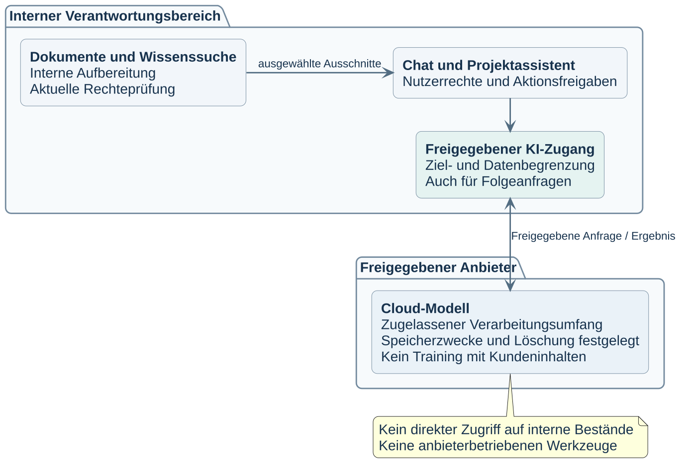

# KI-Referenzszenarien

Die Referenz umfasst gemeinsame KI-Funktionen mit zwei getrennten Verarbeitungswegen. Maßgeblich sind die Kontrollen im [OSCAL-Katalog](../katalog/ki-it-sicherheitskatalog.oscal.json), erschlossen über den [Inhaltsindex](INHALTSINDEX.md#kontrollen).

## Air-Gap

Anwendungen, Modelle, Dokumentaufbereitung und Wissenssuche liegen in der abgeschlossenen Umgebung. Externe Dateien durchlaufen das bestehende Übernahmeverfahren. Der gestrichelte Übergang stellt keine Netzwerkverbindung dar. Externe Modellendpunkte und Ausweichziele sind ausgeschlossen.

## Cloud

Dokumentablage, Aufbereitung, Suchvektoren und Rechteprüfung bleiben intern. Der freigegebene KI-Zugang übermittelt nur ausgewählte Eingaben, zulässigen Kontext und genehmigte Werkzeugrückmeldungen an den Anbieter. Dieser erhält keinen direkten Zugriff auf interne Bestände oder lokale Werkzeuge. Die Anbieterfreigabe umfasst Speicherung, Löschung, Verarbeitungsorte, mögliche Zugriffe und Ausschluss von Training mit Kundeninhalten. Ein allgemeiner Internetzugang genügt nicht.

## Gemeinsame Nutzungsgrenzen

Chat und Wissenssuche beachten individuelle Quellrechte. Persönliche Gespräche und Agentenarbeit gelangen nicht automatisch in gemeinsame Bestände. Ergebnisprüfung und Freigaben bleiben bei den befugten Personen.

Der Projektassistent führt genehmigte Datei- und Befehlsaktionen mit den bestehenden Nutzerrechten aus. Die Ausgangskonfiguration verlangt Einzelgenehmigungen. Projektfreigaben sind auf Auftrag und Wirkung begrenzt. Die interne Verarbeitung der Chatanwendung stellt keinen eigenen serverseitigen Codeausführungszugang für Nutzende bereit.

Für allgemeinen IT-Betrieb, Datensicherung und Dateiübernahmen gilt das bestehende Informationssicherheitskonzept. Training und Feinabstimmung bleiben ausgeschlossen. Zwischen den Szenarien besteht kein automatischer Wechsel. Die betrieblichen Aufgaben bleiben ohne KI durchführbar.
